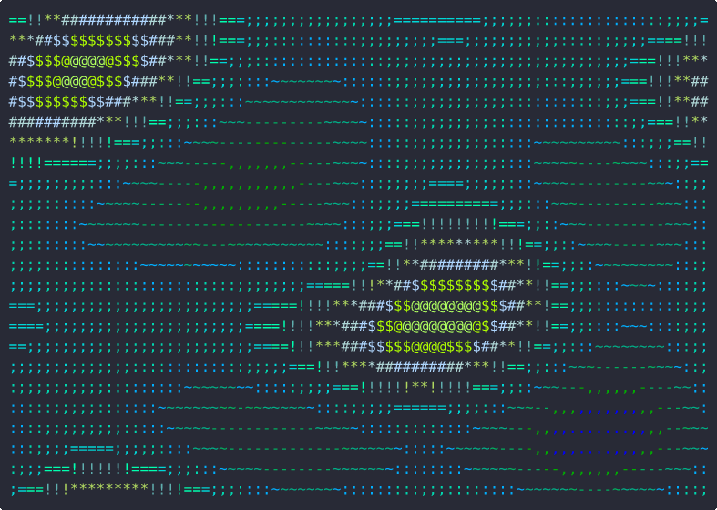
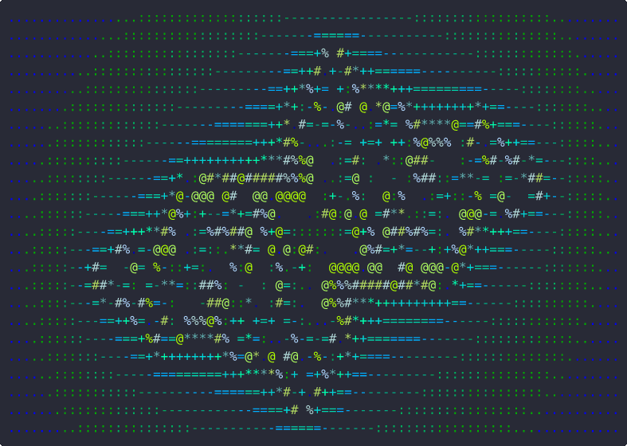
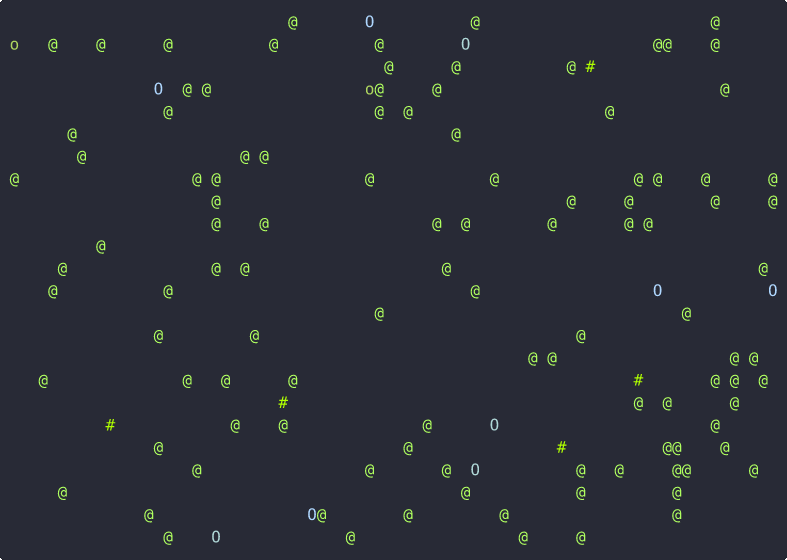
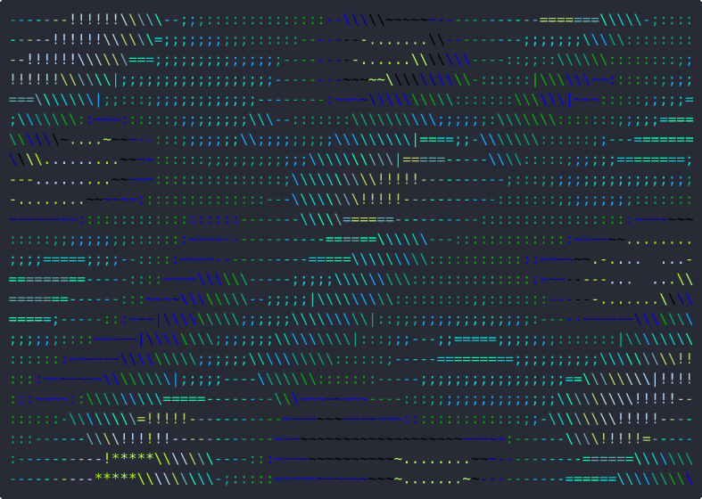
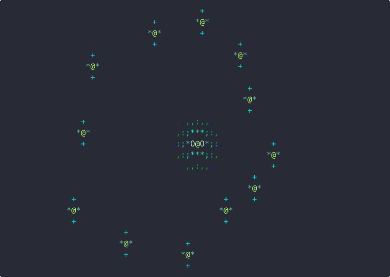
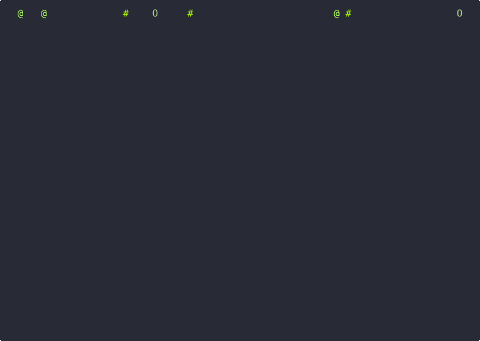
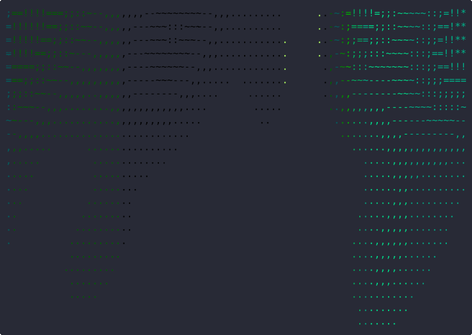
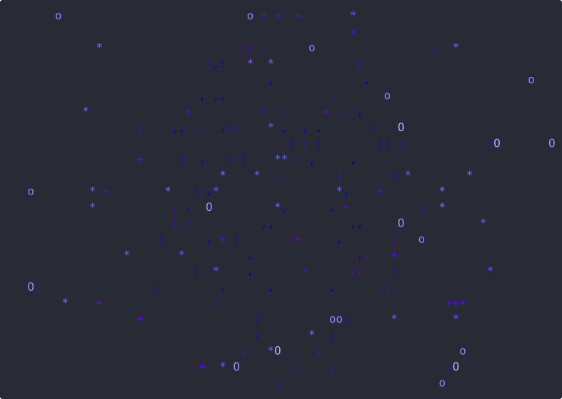
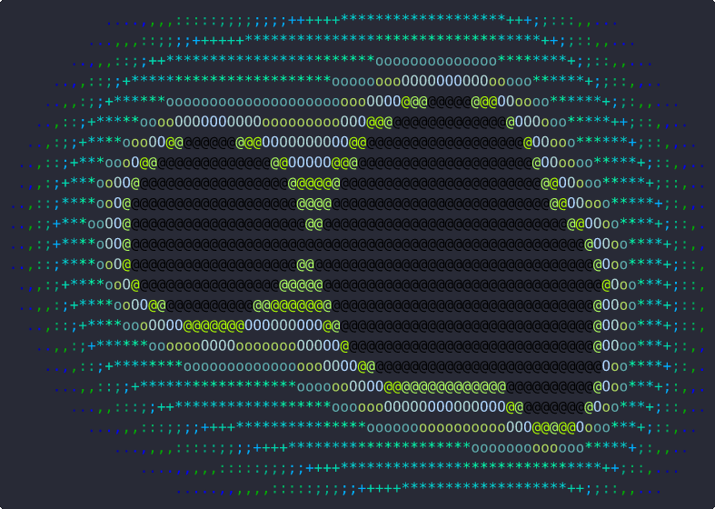
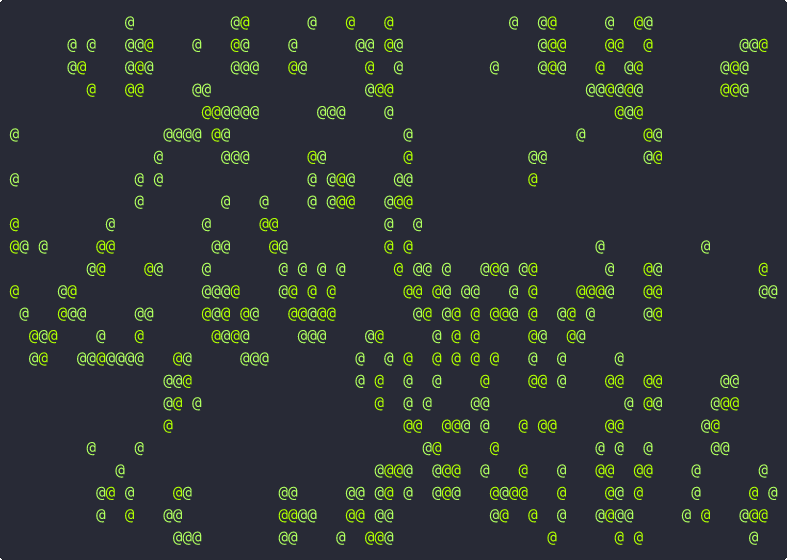

# zenrelax

A soothing terminal screensaver written in pure C. Ten visual modes render calming animations directly in your terminal using ANSI escape codes and 256-color palettes.

## Modes

### 1. Plasma Wave
Layered sine/cosine interference patterns



### 2. Fractal Mandelbrot
Slowly drifting Julia set exploration



### 3. Particle Physics
128 particles with gravitational attractors and trails



### 4. Quantum Flow
Flowing field visualization with directional characters



### 5. Orbital Harmony
12 orbiting bodies with trails and central body glow



### 6. Rainfall
Depth-layered raindrops with ripples at the bottom



### 7. Aurora Borealis
Shimmering curtains of light with vertical falloff



### 8. Starfield
Deep-space fly-through with perspective and motion streaks



### 9. Metaballs
Lava lamp blobs that merge and split using distance fields



### 10. Game of Life
Conway's automata with color aging and periodic seeding



## Build

```
make               # optimized build
make debug         # debug build for gdb
make sanitize      # address + undefined behavior sanitizers
```

Or directly:

```
gcc zenrelax.c -o zenrelax -lm
```

## Usage

```
./zenrelax         # random mode
./zenrelax 3       # jump straight to Particle Physics
./zenrelax --help  # show available modes
```

Press `q`, `ESC`, or `Ctrl+C` to quit.

## Features

- Tmux-aware with SIGWINCH resize handling
- Alt screen buffer (restores terminal on exit)
- Raw input mode for responsive key handling
- Runs at ~20fps with buffered output

## Development

Install optional tools:

```
sudo apt install clang-format clang-tidy cppcheck valgrind clangd
```

```
make format        # auto-format code
make lint          # static analysis with cppcheck
make gifs          # re-record mode GIFs (requires agg)
valgrind ./zenrelax 1   # memory leak check
```

To regenerate GIFs, install [agg](https://github.com/asciinema/agg/releases) and run `make gifs`.
